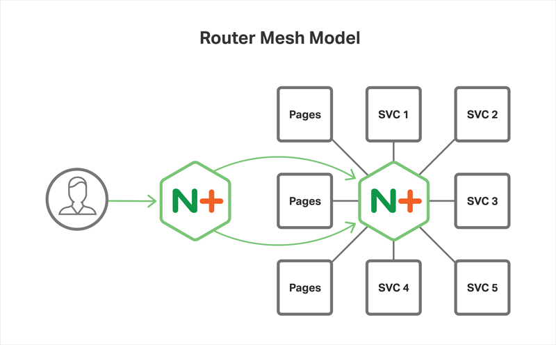

# HTTP MSOA

Demonstration on a monorepo'd approad to http msoa optimized for local development.

For use in [Proxy Model](https://www.nginx.com/blog/microservices-reference-architecture-nginx-proxy-model/) or [Router Mesh Model](https://www.nginx.com/blog/microservices-reference-architecture-nginx-router-mesh-model/)



## Features

- fallback to defined url (example.com/&lt;service name&gt;)
- automated config generator
- automated dockerfile generator
- common function folder

## Requires

- [docker](https://docker.com)
- [asdf](https://asdf-vm.com) - node

```bash
# Install Dependencies
npm install

# Build the configs and dockerfiles
npm run build-conf

# Run docker compose
#   docker-compose up --remove-orphans
docker compose up --remove-orphans
```

```bash
# Start all the services
npm start
#   ...then http://localhost:8080/<service name>

# ...or start an individual service
npm run start:<service name>
#   ...then http://localhost:8080/<service name>
```

## Todo

- [ ] default.conf
- [ ] database
- [ ] git diffing image builds
